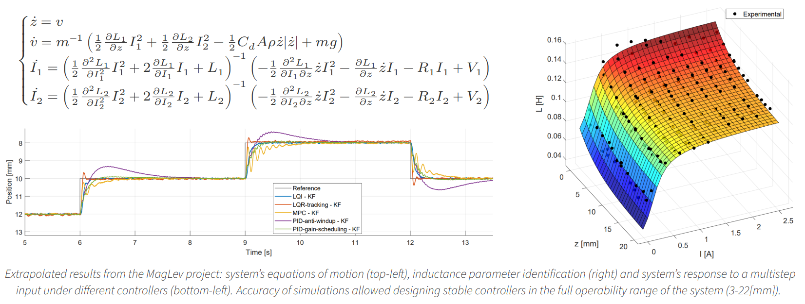

# Welcome :panda_face:!

Here is Tommaso, a passionate coder and robotics enthusiast.
I hold a Bachelor's degree in Mechanical Engineering (@Politecnico_di_Milano) and I'm just about to complete my Master's degree in Robotics and Mechatronics at the same university.

  <h3>
    <b>I love model-based approach, control theory and embedded systems.</b>
  </h3>

While university gave me a solid theoretical background on the first two topics, I had the chance to explore the latter working on several personal projects.
The joy of seeing a low-level code running on a microcontroller, making a robot move, is something I will never get tired of.

## Technical skills

I'm proficient in *MATLAB/Simulink*, *C/C++*, *Python*, and the *Robot Operating System (ROS)*, with hands-on experience across their ecosystems, toolchains, and widely used libraries.
In addition, I have a solid understanding of modern web development.

On the hardware side, I'm comfortable working with embedded systems (as long as the electronics aren't faulty out of the box :( ).
I have practical experience with the *Arduino* family, *Raspberry Pi*, and *STM32* microcontrollers, as well as a wide range of commonly used sensors and actuators in robotics applications.

## Explore around

I try to keep my projects organized and documented, for this reason you can find my coding activities spread across these profiles/organizations:
- [Personal GitHub](https://github.com/Bocchio01): mostly spare time projects and experiments.
- [Bocchio's Web Lab](https://github.com/bocchio-web-lab): a collection of web projects, including my personal website and some web applications I developed on commissions.
- [Bocchio's Academic Projects](https://github.com/bocchio-academic-projects): a complete archive of my academic work, showcasing my commitment to learning and growth in the field of robotics and mechatronics.

 

 

## Get in touch

Sometimes I feel I've already to many ideas and projects on my own, but I'm always open to new opportunities and collaborations.
If you have an interesting project in mind, or if you just want to chat about robotics, feel free to reach out to me via [email](mailto:tommaso.bocchietti@gmail.com) or connect with me on [LinkedIn](https://www.linkedin.com/in/tommaso-bocchietti/).

Have a nice coding day,

Tommaso :panda_face:
